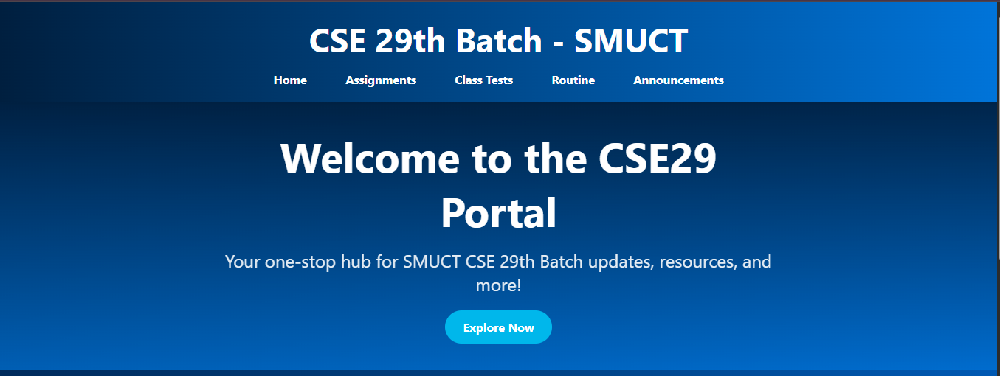
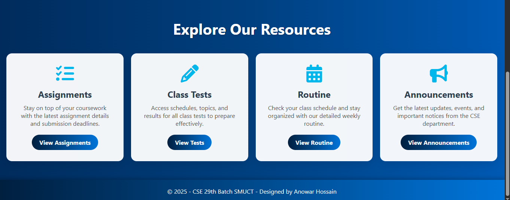

# CSE29-Portal 🚀

[Visit on Netlify → CSE 29 Portal](https://cse29portal.netlify.app)  

This is a class portal website for the SMUCT CSE 29th Batch. It serves as a centralized hub for students to access important academic resources and updates, including:

📚 Assignments: Track coursework and submission deadlines.  
📝 Class Tests: View schedules and details for upcoming tests.  
📅 Routine: Access class and exam schedules.  
📢 Announcements: Stay updated with the latest news, events, and academic calendars.

## 📂 Project Structure

- index.html — Homepage with an overview of portal features.  
- assignments.html — Lists current assignments with deadlines.  
- class-tests.html — Displays upcoming class test schedules.  
- routine.html — Provides class and exam routine details with downloadable resources.  
- announcements.html — Shows important updates and academic calendars.  
- style.css — Handles styling and responsiveness across all pages.  
- assets/ — Contains images like Class Routine and Academic Calendar.

## 📌 Features

- Responsive Design: Optimized for mobile, tablet, and desktop devices.  
- Modern UI : Clean layout with gradient backgrounds, animations, and Font Awesome icons.  
- Interactive Navigation : Easy access to all sections via a sticky header.  
- Downloadable Resources : Class Routine and Academic Calendar available for download.  
- Scalable Structure : Built to support future enhancements like additional sections or features.

---

## 🛠️ Technologies Used

- HTML5 : Semantic structure for all pages.  
- CSS3 : Custom properties, gradients, animations, and responsive grid layouts.  
- Font Awesome: Icons for visual enhancement.  
- Netlify: Hosting for seamless deployment.

---

## 🔧 Upcoming Updates

- Study Material Uploads : Enable students to share notes, slides, and other resources.  
- Student Login System : Restrict access to authenticated users.  
- Dark Mode Toggle : Enhance user experience with a dark theme option.  
- GitHub Pages Deployment : Alternative hosting for broader accessibility.  
- Interactive Calendar : Dynamic calendar for real-time schedule updates.

## 🚀 Getting Started

Clone the Repository:

bash

git clone https://github.com/AnowarOHossain/CSE29-Portal.git

Navigate to Project Directory:
bash
cd CSE29-Portal

Open in Browser:
- Open `index.html` in a web browser to view the portal locally.  
- Alternatively, use a local server (e.g., live-server) for a better development experience.

## 📸 Screenshots

### Homepage

### Routine Page

## 👨‍💻 Developer

Anowar Hossain
CSE 29th Batch, SMUCT
📧 Email: [Anowar44400@gmail.com](mailto:Anowar44400@gmail.com)  
🔗 GitHub: [AnowarOHossain](https://github.com/AnowarOHossain)

## 📜 License

This project is licensed under the MIT License - see the LICENSE file for details.
